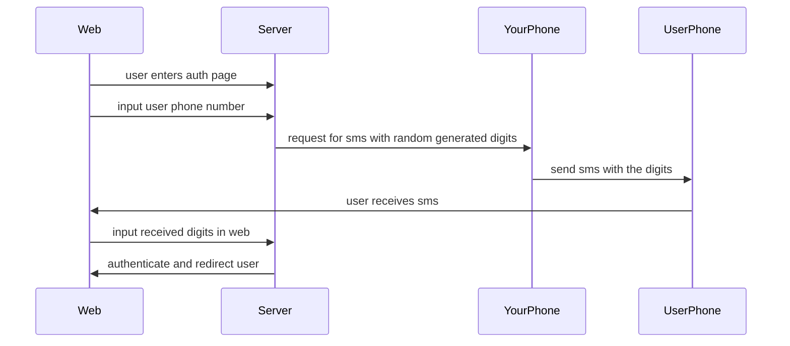

#### Authenticate User by Phone Using Your Phone

---------------------

```mermaid
sequenceDiagram
    Web->>Server: user enters auth page

    Web->>Server: input user phone number
    
    Server->>YourPhone: request for sms with random generated digits
    
    YourPhone->>UserPhone: send sms with the digits
    
    UserPhone->>Web : user receives sms
    
    Web->>Server: input received digits in web
    
    Server->>Web: authenticate and redirect user
```  

